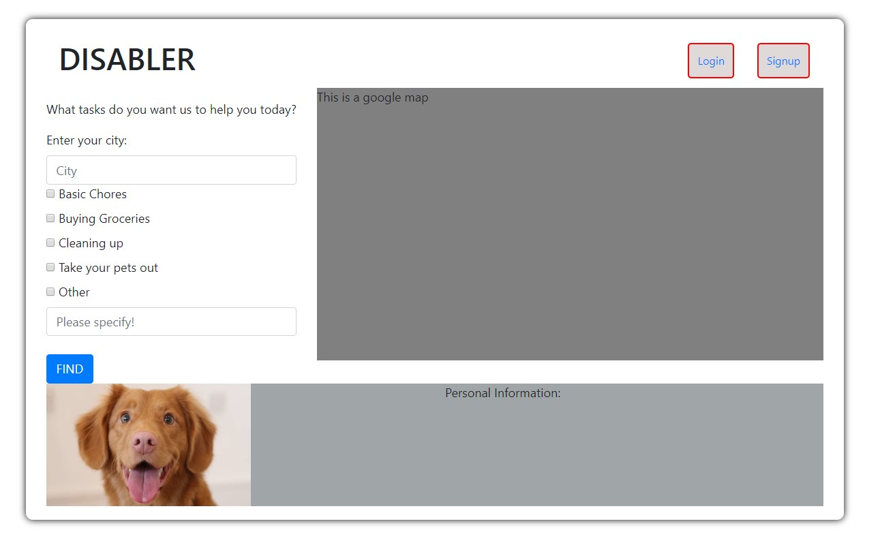
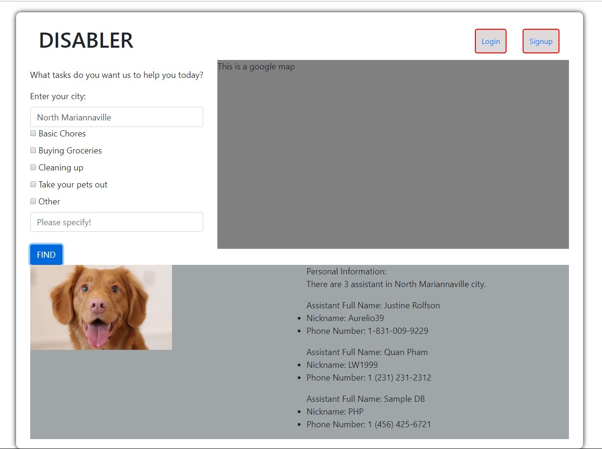
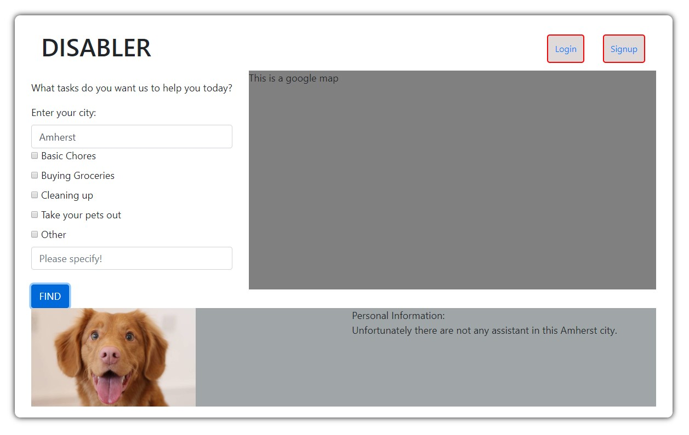
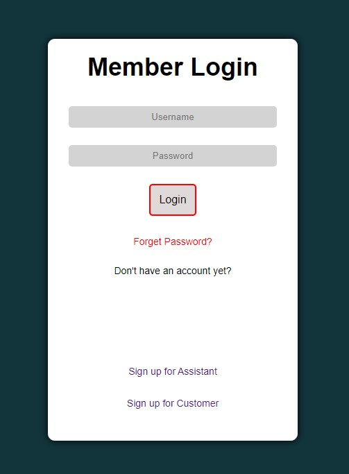
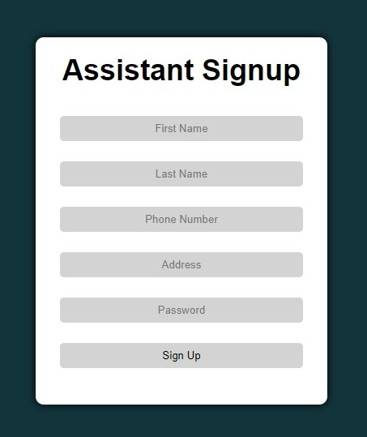
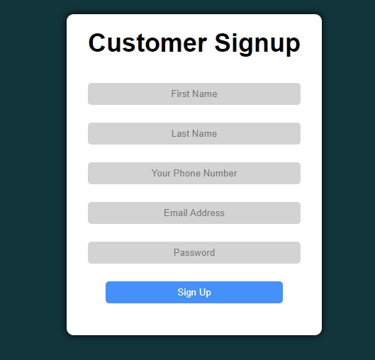

### PSI ###
### Diabler ###
https://polar-caverns-77542.herokuapp.com/
### Spring 2020 ###

### Overview ### 
Our website is called DISABLER, which aims for the disabilities people to get the contact of the assistance around their neighborhood, for the short term needs, such as taking out groceries, cleaning, or buying stuffs, etc. However, after discussing furthermore, we can see that our website is also beneficial for elderly people, since they also need help on their daily basis activities.

WHY INNOVATIVE YOU MAY ASK?
As we have researched online, there are currently limited apps to satisfy this requirements of the disabled (The closest one we can find is RED ALERT app, which is used when the disabled people are in emergency). To some extent, some disabled/elderly people cannot perform their daily activities, thus, having an extra hand from the assistances around the neighborhood during this time would help a lot.


### Team Members ### 
- Quan Pham Minh: QuanPham99
- Quoc Anh Bui: qhbui
- Thao Trinh: thaotrinh

### User Interface ###
Our interface is designed to be as simplist as possible. It will include:

The main page: where you can type in your city and find whether there are assistance available around the neighborhood

- The overall homepage will be:


- When there are assistance available in their city: 


- When there are no assisatnce in their city:


- The login page: Where you can log in to your account 


- The sign up page: You are be either want to be an assistance, or a person who need help. 




### APIs ###
For simplicity, our website will have the API as follows:

```/find```: The endpoints to query for the city that the user want to find the assistance.

```/login```: The endpoints to login to the user account.

```/signup```: The endpoints for the users/assistance to create their own account. 

### Database ###
In our database, each person will be saved as a JSON object:
```
{
    username : // Nickname of the user
    value : {
        f : // First name
        l : // Last name
        no: // Phone Number
        a: // City
    }
}
``` 

After discussing, we have created 2 databases for our website:
- First database: Assistances database 
- Second database: Customers/Users database

In our users database, we implemented normally such that we can get the users based on the username, since it's more unique to find. However, in the assistance database, we implemented such that when the users type in the city, it will return all of the assistances availble in that city, along with their personal information. 

We have make used of ```npm faker``` to generate approximately 100 fake datas for both of the database for testing and running the server. 

### URL Routes/Mappings ###
```/```: The homepage of the website.

```/login.html```: The login site.

```/assistancesignup.html``` and ```/customersignup.html```: Sign up site for the users/assistances 

### Division of labor ###
- Quan Pham Minh:
  + Homepage/index.html
  + 1/2 of client.js
  + Server + Heroku deployment
- Quoc Anh Bui: 
  + Database implementation
  + 1/2 of client.js
  + Signup/Login html

### Conclusion ###

During the time implementing this project, we have encountered quite a lot of troubles:
- Heroku deployment
- Working with APIs / Routes in the server.
  
These 2 are 2 of the most challenging tasks we have dealt with throughout the process of developing this project. During the implementation of the project, we wish we knew more about how the server APIs, Routes actually working and having a simple demo on a real actual running server, since it would help in understanding how those things work. But we managed to vaguely understood it, and ran the server to work 