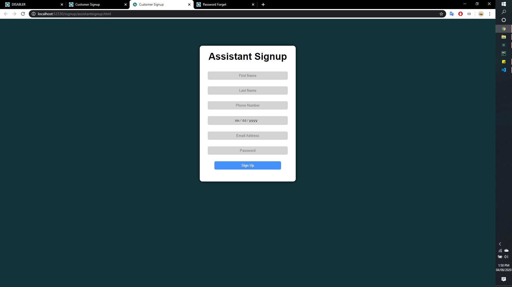
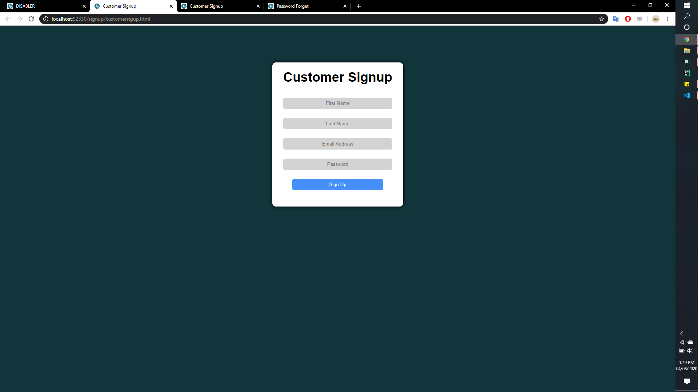
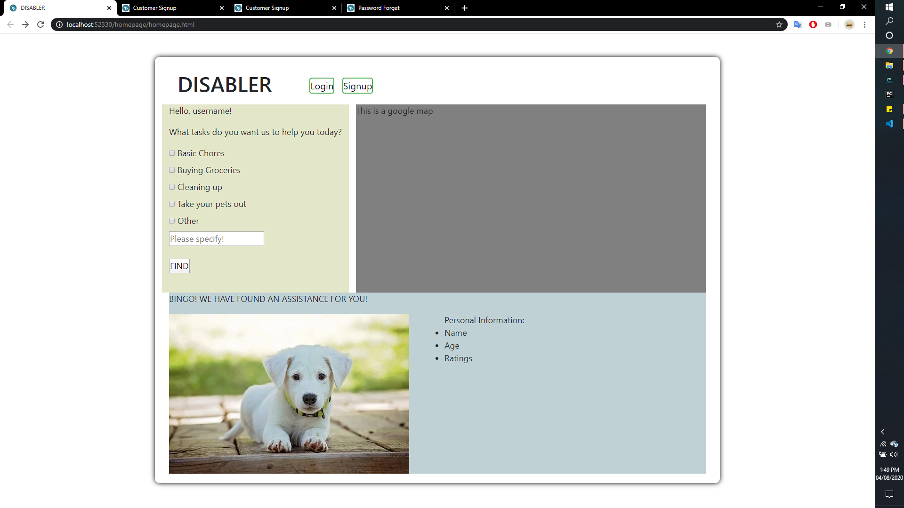

Application web name: 
    Disabler

Description: 
    Our goal for the website is for the disbilities people can find assitance to perform short term/urgent tasks, such as doing chores, buying groceries, etc.
    
    Currently there is a similar app, which is Red Panic button. However, it's more of an emergency problems for the people. Also, there are several more apps that helps people with specific disability, like DPA: helps people with traveling, HelpTalk: helps people with speech impairment, etc. But there are still no solution to the help with the basic needs for the disabilities.

Innovative Idea:
    The apps style is similar to Uber, but instead of asking for rides, the disabilites will ask for assistance around the neighborhood, with the design of clicking options, instead of typing down, thus this would help more people with disabilities. People around the neighborhood will be pinged when someone request something and help them with the task.

User Interaction:
- There will be 2 types of people logging in the website:
    + Assistance (people with no disabilities):
        * They will log in to their account and input credentials information.
        * Assisstance will be required to input their First and Last name, phone number, SSN, as well as car license plate, in order to track them down easier, in case things went wrong
        

        * They will also be rated (5 stars) based on how they well treat that people.  
        
    + Disabilities people:
        * If they choose they are disabled person, they can skip all of the information credential input steps. 
  
        * Logging in and creating an account will be easier with some features assistance (will be figured out along the way). They can choose their type of disablities to give more information for the assistance (This is optional since someone might not feel comfortable sharing it).
        * As in the picture here, they will only have to input First name, last name, email address, password, and the phone number
        

        * They will select from a fixed number of options of tasks and then press FIND to find someone (for now the number of tasks will only be simple with: buy groceries, do chores, walking).
  
        * Then they will wait for the assistance to accept the tasks and perform it.
  
        * The disabilities person can cancel the person if after they read the profile while waiting. 

    + Upon loggin in, the users will also have the options of fogetting the password, and they will choose to input their email address to retrieve their account back.
    

    + There will be a notification when the assistance accept the tasks, and their info will be briefly displayed (accessible for people with disabilities) (to be figured out later)
  
    + The map will be showing after the disabilities click find someone to show how far the assitance is. (That's the idea, we will change accordingly when we implementing it)
  
    + This is the overall layout of the website, we are working on how to input the map into out website, as well as fixing the background color (due to time constraint, so this would take sometimes before the deadline)
    
    
