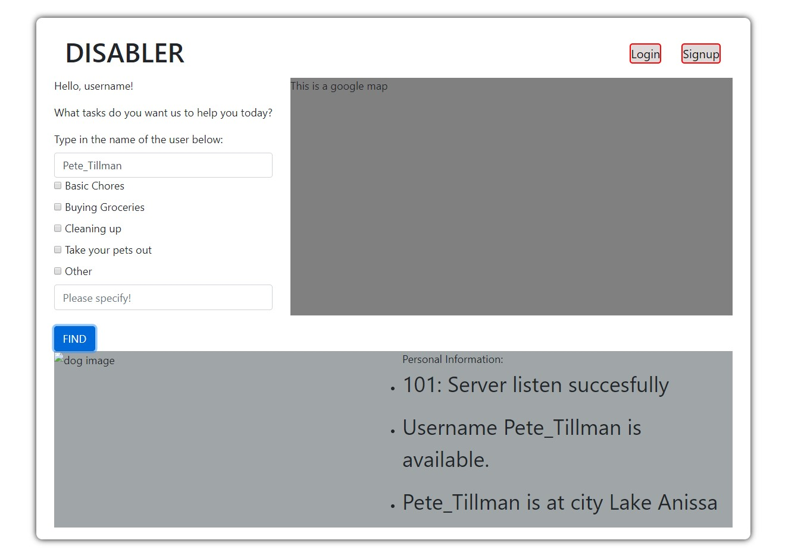
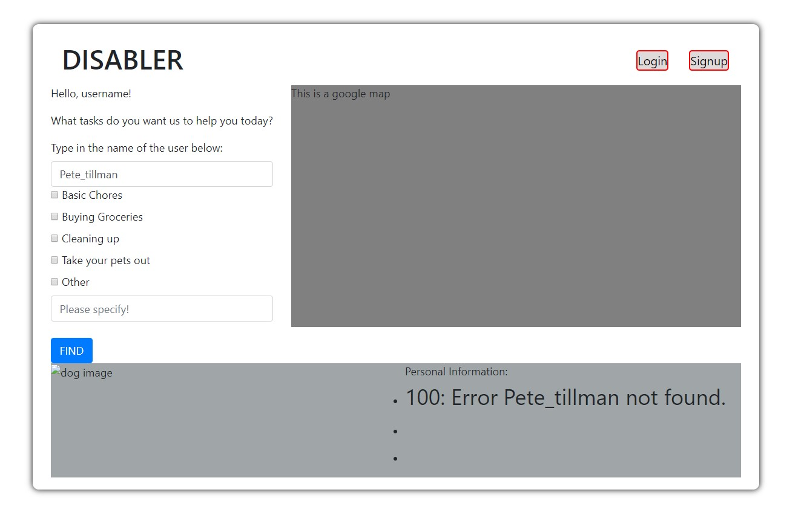

# Milestone 2: Server and Database #
## Application Overview ##
Recall that we are building an application that helps user (customer) to find the neareast assistants in their local area with their tasks. 
### Objectives ###
In this Milestone, we will create a server  - ``` server.ts ``` and a database - ``` Database ``` using MongoDB. The server can listen to requests from client and send back data from the database.

First, we define the data-flow. Note that, if you look at 2 files in ``` Database ``` folder - ```customerdb.ts``` and  ```assistantdb.ts```, the objects defined are pretty similar where both ```Customers``` and ```Assistants``` objects both have:
```
{ 
    username,
    value: {
        First Name,
        Last Name,
        Address, 
        Phone,
        Password,
    }
}

```
The request that we choose to implement is called ```Find```: https://polar-caverns-77542.herokuapp.com/

### Project API Planning ###
Our website is based on REST priciples

- GET: Retrieve resources from the database
- POST: Create resources and write to database
- PUT: Write the resources to the database
- DELETE: Delete the resources from the database


Reponse Status Code:
- 101: When users sucessfully find a name that match.
  
- 100: When the users input incorrect username
   

Endpoints: 
Since for our website, we do not have to create any new users yet, we only have to find the users, which we put in the URI: 
```localhost:8080/users/:userID/find```

At the moment, there is only 1 required parameter, which is the username of the assistance. Later on we will add more features to the current web.

Reponse: 
- Result: JSON object as described above
- ```userID```: username of the assistance that the users wants to search


### Application Structure ###
* ``` server.ts ```: Handle requests and error, return the data from the database.
* ```Database/customerdb.ts``` and ```Database/assistantdb.ts```: database logics such as ```findOne()```, ```updateOne()``` and ```deleteOne()```.
* ```client.js```: a client-side JS file which pings endpoints and then output the returned JSON to ```index.html```.

### Labor Division ###
- Quan Pham: ```server.ts``` and ```client.js```.
- Quoc Anh Bui: ```customerdb.ts``` and ```assistantdb.ts```.


### Additional Note ###
- Since we want to test out our server, such we have to create fake data using ```faker``` and write that to MongoDB.
- We will add more features for the users to search for assistance more. 